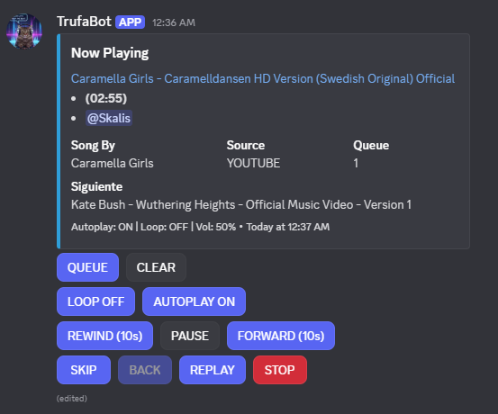
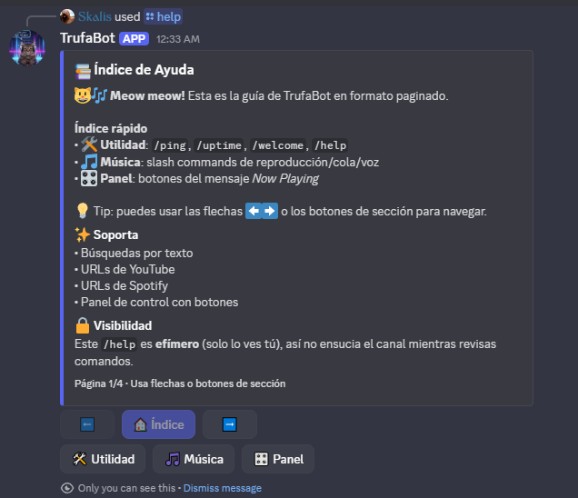

# 🤖 TrufaBot


## 📸 Vista previa

### 🔹 Panel de música (Now Playing + botones)



### 🔹 `/help` paginado (índice + secciones)



---

**TrufaBot** es un bot de Discord modular construido con **Node.js + TypeScript**.
Incluye un módulo de música con panel interactivo, autoplay con prefetch, soporte para YouTube y Spotify (con fallbacks), además de comandos de utilidad como `/help`, `/ping`, `/uptime` y `/welcome`.

El proyecto está pensado como base escalable para seguir agregando módulos y comandos sin romper la estructura actual.

Si tu objetivo es **estudiar el proyecto completo** (incluyendo flujo real, debugging y arquitectura del módulo de música), el documento principal es:

- [docs/GUIA-HISTORICA.md](docs/GUIA-HISTORICA.md)

Si solo le vas a pasar **un archivo** a un junior para entender el proyecto de punta a punta, pasa [docs/GUIA-HISTORICA.md](docs/GUIA-HISTORICA.md).

---

## 💡 Propósito del proyecto

TrufaBot nace como un proyecto para:

1. Aprender arquitectura de bots de Discord con una base modular y mantenible.
2. Construir un módulo de música real con controles, cola, autoplay y validaciones.
3. Practicar integración de múltiples librerías (`discord.js`, `DisTube`, `yt-dlp`, Spotify).
4. Documentar el proceso completo (setup, flujo, debugging, decisiones técnicas).

También funciona como práctica avanzada de backend/eventos, manejo de estados por guild y troubleshooting de integraciones externas.

---

## 📚 Documentación técnica

Para el detalle completo de arquitectura, flujo interno y evolución del proyecto:

- [docs/GUIA-HISTORICA.md](docs/GUIA-HISTORICA.md) (documento maestro: setup + historia + flujo + troubleshooting + onboarding archivo por archivo)
- [docs/discord-music-bot-architecture.md](docs/discord-music-bot-architecture.md) (visión macro / diseño arquitectónico y roadmap técnico)

### Orden recomendado de lectura (GitHub / onboarding)

1. [README.md](README.md) (esta portada)
2. [docs/GUIA-HISTORICA.md](docs/GUIA-HISTORICA.md) (lectura principal; suficiente para entender el proyecto completo)
3. [docs/discord-music-bot-architecture.md](docs/discord-music-bot-architecture.md) (visión de alto nivel y crecimiento futuro)

---

## ✨ Características

- 🎵 **Reproducción por texto** (`/play despacito`)
- 🔗 **Reproducción por URL** (YouTube y Spotify)
- 📃 **Playlists públicas** (YouTube y Spotify) con carga progresiva
- 🎛️ **Panel Now Playing** con botones de control
- 🔁 **Autoplay** con prefetch y filtros anti-repetición
- ⏪⏩ **Seek rápido** (`rewind` / `forward`)
- 🔉 **Control de volumen** (`/volume`)
- 🧾 **Cola paginada** (`/queue`)
- 📌 **Resumen de pista actual** (`/nowplaying`)
- 🧹 **Clear queue** (`/clear`) y **salida de voz** (`/quit`)
- 🐱 **Mensaje de bienvenida** al entrar a un servidor + comando `/welcome`
- 📚 **/help paginado** con botones (índice + secciones)
- 📝 **Logs estructurados** con `pino`
- ⏱️ **Auto-desconexión por inactividad** y por canal vacío

---

## 🛠️ Tecnologías

- **Node.js** + **TypeScript**
- **discord.js v14**
- **DisTube**
- **@distube/yt-dlp**
- **@distube/spotify**
- **@distube/youtube** (modo extractor de búsqueda)
- **ffmpeg**
- **@discordjs/voice**
- **pino** (logs)

---

## 📦 Requisitos

- Node.js **20+** (recomendado **20 LTS**)
- `npm`
- `ffmpeg` instalado y disponible en `PATH`
- Bot de Discord creado en el Developer Portal

Scopes recomendados al invitar el bot:

- `bot`
- `applications.commands`

---

## 🔧 Instalación

### 1️⃣ Instalar dependencias

```bash
npm install
```

### 2️⃣ Crear archivo de entorno

```bash
copy .env.example .env
```

En Linux/macOS usa:

```bash
cp .env.example .env
```

### 3️⃣ Configurar variables mínimas

```env
DISCORD_TOKEN=tu_token_del_bot
CLIENT_ID=tu_application_client_id
GUILD_IDS=123456789012345678,987654321098765432
```

### 4️⃣ (Opcional, recomendado) Spotify API

Para mejorar estabilidad y evitar límites del modo scraping en playlists/álbumes grandes:

```env
SPOTIFY_CLIENT_ID=...
SPOTIFY_CLIENT_SECRET=...
```

---

## 🚀 Ejecutar en local

### Registrar comandos slash (por guild)

```bash
npm run commands:register
```

Si agregas un comando nuevo o metes el bot a otro servidor, vuelve a correr ese script.

### Desarrollo

```bash
npm run dev
```

### Build + start

```bash
npm run build
npm start
```

La salida compilada se genera en:

```text
dist/
```

---

## 🔄 Flujo de uso (rápido)

1. Invita el bot al servidor.
2. Registra comandos con `npm run commands:register`.
3. Entra a un canal de voz.
4. Usa `/join` (opcional) o directamente `/play <texto|url>`.
5. Controla la reproducción desde el panel (`QUEUE`, `CLEAR`, `LOOP`, `AUTOPLAY`, etc.).
6. Usa `/queue`, `/nowplaying`, `/volume` para operaciones rápidas.

---

## 🎵 Comandos principales

### Utilidad

- `/ping`
- `/uptime`
- `/help`
- `/welcome`

### Música (slash commands)

- `/join`
- `/play`
- `/pause`
- `/resume`
- `/skip`
- `/back`
- `/autoplay`
- `/loop`
- `/rewind`
- `/forward`
- `/replay`
- `/nowplaying`
- `/queue`
- `/clear`
- `/volume`
- `/stop`
- `/quit`

### Panel de música (botones)

- `QUEUE`
- `CLEAR`
- `LOOP`
- `AUTOPLAY`
- `REWIND`
- `PAUSE/RESUME`
- `FORWARD`
- `SKIP`
- `BACK`
- `REPLAY`
- `STOP`

---

## ⚙️ Variables de entorno (relevantes)

### Discord

- `DISCORD_TOKEN`
- `CLIENT_ID`
- `GUILD_IDS`

### Spotify (opcional)

- `SPOTIFY_CLIENT_ID`
- `SPOTIFY_CLIENT_SECRET`

### Runtime / logs

- `LOG_LEVEL`

### Música (timeouts / tuning)

- `MUSIC_NO_PLAYBACK_TIMEOUT_MS`
- `MUSIC_EMPTY_CHANNEL_TIMEOUT_MS`
- `MUSIC_LOCK_TIMEOUT_MS`
- `MUSIC_STALE_LOCK_RELEASE_MS`
- `MUSIC_AUTOPLAY_RECENT_LIMIT`
- `MUSIC_AUTOPLAY_RECENT_TTL_MS`
- `MUSIC_AUTOPLAY_RANDOM_POOL_SIZE`
- `MUSIC_PLAYLIST_PROGRESSIVE_FLAT_TIMEOUT_MS`
- `MUSIC_PLAYLIST_PROGRESSIVE_MAX_ENTRIES`
- `MUSIC_PLAYLIST_PROGRESSIVE_BATCH_DELAY_MS`

---

## 🧪 Verificación / scripts útiles

```bash
npm run dev               # Ejecuta el bot con tsx
npm run commands:register # Registra slash commands en los guilds configurados
npm run typecheck         # TypeScript (sin emitir)
npm test                  # Alias estable de typecheck (default al codear)
npm run test:smoke        # Smoke de proveedores externos (yt-dlp/YouTube)
npm run verify            # test + build + smoke (validacion completa)
npm run lint              # Lint (requiere eslint.config.* con ESLint v9)
npm run build             # Compila a dist/
npm run start             # Ejecuta el build compilado
npm run clean             # Limpia dist/
```

Smoke test local de playlists (script auxiliar):

```bash
node scripts/music-playlist-smoke-test.mjs
```

---

## ⚠️ Limitaciones conocidas

- YouTube/Spotify pueden romper o degradarse temporalmente por cambios externos (extractores, rate limits, scraping).
- Sin credenciales de Spotify, playlists/álbumes pueden quedar limitados a ~100 tracks.
- Algunas fuentes/URLs no públicas (privadas, restringidas, edad/región) pueden fallar sin cookies/autenticación.
- El módulo de música depende de `ffmpeg` y del estado de `yt-dlp.exe` en el entorno local.
- El smoke test (`npm run test:smoke`) depende de red y de proveedores externos; úsalo como validación operativa, no como test unitario determinista.
- El script `npm run lint` requiere un `eslint.config.*` compatible con ESLint v9.

---

## 🛡️ Seguridad y buenas prácticas

- `.env` está ignorado por `.gitignore`.
- No subas tokens, secrets, cookies ni archivos de configuración local.
- Antes de publicar cambios, revisa:
  - `git status`
  - `git diff`

---

## 📌 Estado actual

Proyecto en estado **funcional**, con foco actual en:

- estabilidad del autoplay y de los fallbacks,
- mejoras de UX del panel,
- robustez de playlists,
- y crecimiento modular del bot.

Documentación:

- [README.md](README.md) orientado a uso/entrada rápida
- [docs/GUIA-HISTORICA.md](docs/GUIA-HISTORICA.md) orientado a aprendizaje completo del proyecto
- [docs/discord-music-bot-architecture.md](docs/discord-music-bot-architecture.md) orientado a diseño y evolución
